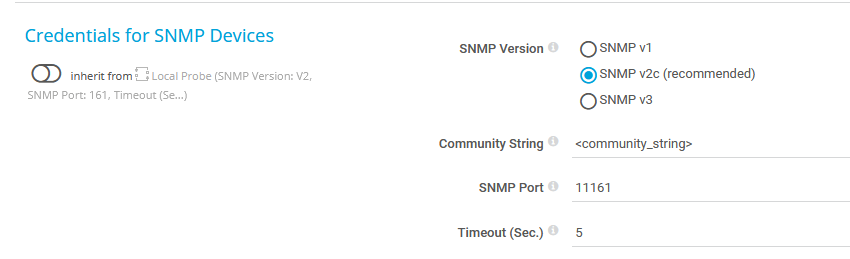
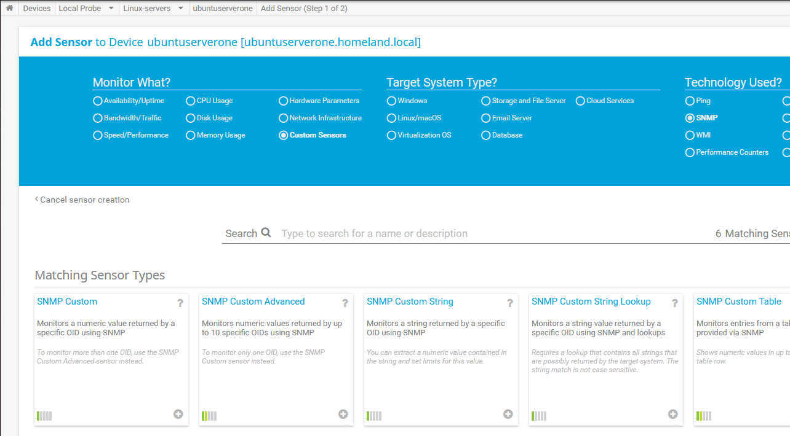
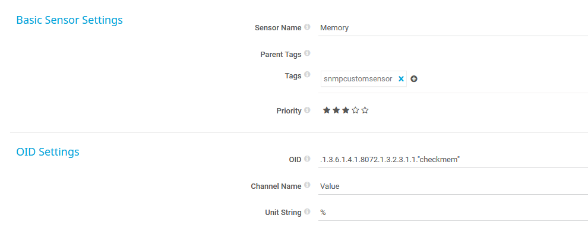
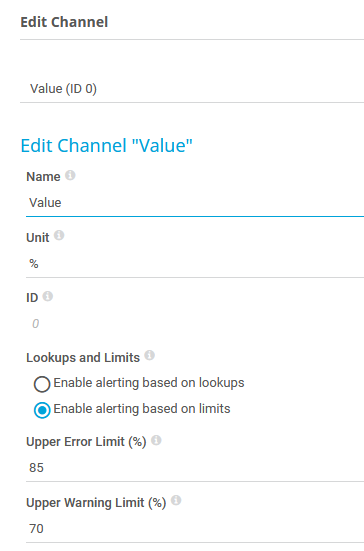
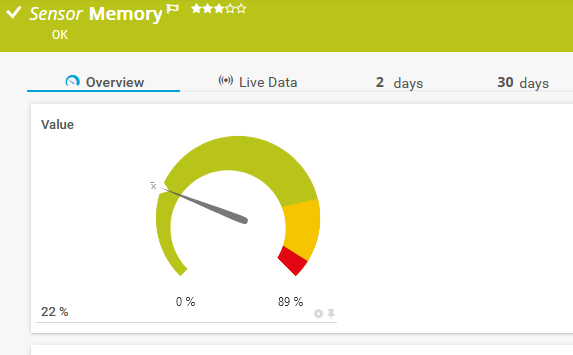

# SNMP EXTEND
En este caso voy a documentar como monitorizar el sistema mediante SNMP Extend, muy útil para la monitorización específica de recursos o servicios.
En este ejemplo monitorizaré el uso de memoria del sistema.

Script que nos devuelve el uso de la memoria en %:

```sh
#!/bin/bash
if [[ "$1" == "mem" ]];then free |grep Mem|awk '{print $3/$2 * 100}'|awk -F"." '{printf $1}';fi
```
Añadir al fichero snmpd.conf:
```sh
extend checkmem /var/prtg/snmp/checksystem.sh mem
```
Reiniciar servicio snmpd.

Configurar PRTG:

Configurar SNMP en el dispositivo o grupo donde se encuentran los dispositivos a monitorizar:


Añadir sensor "SNMP Custom":


Configurar sensor:
Para saber el número de OID podemos usar la herramienta snmptranslate
```sh
snmptranslate -On NET-SNMP-EXTEND-MIB::nsExtendOutput1Line .1.3.6.1.4.1.8072.1.3.2.3.1.
```


Editar el canal para definir unos umbrales de alerta:\


Resultado:\

